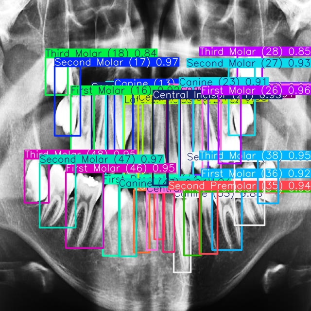
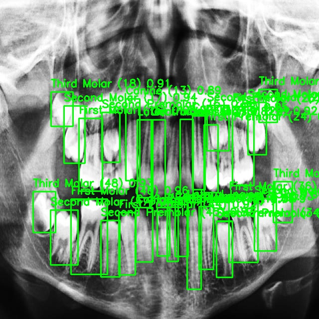
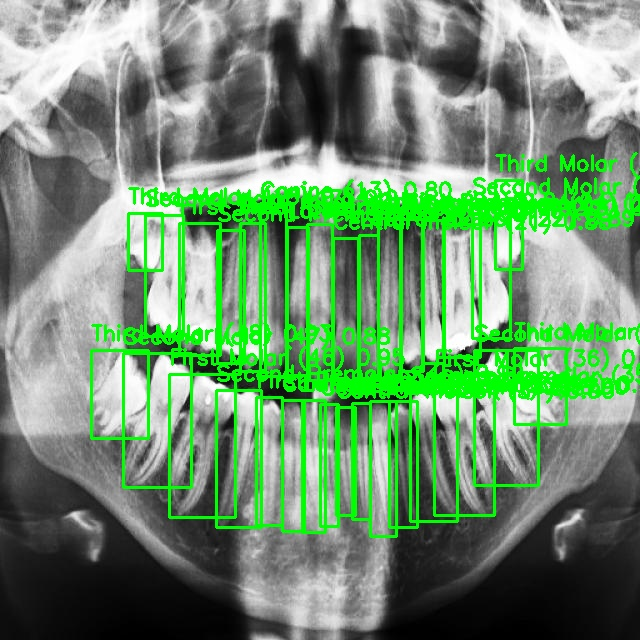

# Dental Tooth Detection and Numbering with YOLOv8


This project implements a state-of-the-art YOLOv8 model to detect and classify 32 different tooth types in panoramic dental X-rays. The system is enhanced with a custom post-processing filter to ensure anatomical correctness, making it a reliable tool for automated dental charting.

## Overview

The primary goal is to automate the identification and labeling of teeth from X-ray images according to the FDI World Dental Federation notation. This involves not only detecting a tooth's location but also accurately classifying its type (e.g., 'Lower Left First Molar' - FDI 36). The final system provides a robust foundation for applications in digital dentistry and diagnostics.

### Key Features
* **High Accuracy:** Achieves an excellent **95.5% mAP@50** on the validation set.
* **Comprehensive Classification:** Distinguishes between all 32 permanent adult teeth.
* **Anatomical Intelligence:** A custom post-processing script filters out predictions that are anatomically impossible (e.g., a lower tooth in the upper jaw), significantly boosting the model's real-world reliability.
* **State-of-the-Art Model:** Built using the efficient and powerful YOLOv8s architecture.

---

## Final Results

The final model, augmented by the post-processing logic, demonstrates highly accurate and clinically relevant performance.

### Performance Metrics
 
| Metric        | Score |
| :---          | :---  |
| **mAP@50**    | **0.955** |
| **mAP@50-95** | 0.665 |
| **Precision** | 0.915 |
| **Recall**    | 0.921 |

### Visual Showcase


*Figure 1: High-confidence detection and classification on a near-complete set of teeth, showcasing the model's accuracy.*


*Figure 2: A cleaned output. The anatomical post-processing filter ensures that all displayed predictions are clinically plausible.*


*Figure 3: A cleaned output. The anatomical post-processing filter ensures that all displayed predictions are clinically plausible.*

---

## Technology Stack
* Python
* PyTorch
* Ultralytics YOLOv8
* OpenCV
* NumPy

## Project Structure
```
dental-yolo-project/
├── assets/             # Contains images for the README
├── data/               # Split dataset (created by script)
├── dataset/            # Raw dataset
├── results/            # Prediction images
├── runs/               # YOLO training outputs
├── src/                # All Python source code
│   ├── split_data.py
│   ├── train.py
│   ├── evaluate.py
│   └── post_process.py
├── data.yaml           # Dataset configuration file
├── requirements.txt
└── README.md
```

---

## Setup and Usage

Follow these steps to set up the environment and run the project pipeline.

### 1. Setup

**Clone the repository:**
```bash
git clone https://github.com/Shrey7174/Dental-yolo-project.git
cd dental-yolo-project
```

**Install dependencies:**
```bash
pip install -r requirements.txt
```

### 2. Usage Pipeline

**Step A: Prepare the Dataset**
*(This step is only needed if you start with raw data)*
Place raw images and labels in the `dataset/` folder and run the splitting script:
```bash
python src/split_data.py
```

**Step B: Train the Model**
To start training, run the following command. Results will be saved in the `runs/detect/` directory.
```bash
python src/train.py
```

**Step C: Evaluate and Post-Process**
To run the final evaluation with the anatomical filter, use this command. The cleaned prediction images will be saved in the `results/post_processed/` folder.
```bash
python src/evaluate.py
```